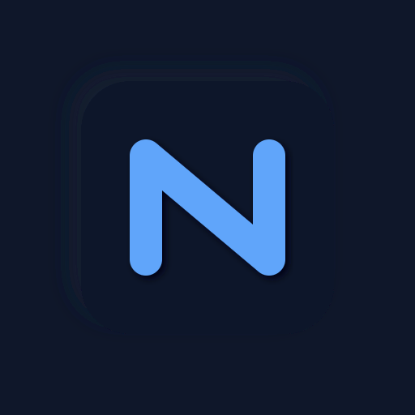

<div align="center">
  

  # NoteView

  Browser-based markdown notes with built-in git version control.

  No server. No account. No lock-in.

  
  
  
  

  **[Launch NoteView &rarr;](https://thunderbug1.github.io/NoteView)**
</div>

## Features

### ✍️ Live Markdown Editor

An Obsidian-like editing experience powered by [CodeMirror 6](https://codemirror.net/). Markdown syntax hides when you're not editing, giving you a clean reading view while retaining full markdown power. Auto-saves with a 1-second debounce.

### ✅ Rich Task Management

Tasks support custom states and inline metadata — due dates, priorities, assignees, and cross-task dependencies:

```markdown
- [ ] Design new landing page [due:: 2026-04-15] [priority:: high]
- [/] Implement search feature [assignee:: @alice]
- [x] Fix login bug [completed:: 2026-04-09]
- [b] Waiting on API docs [dependsOn:: ^backend-api]
- [-] Deprecated approach
```

| State | Meaning |
|:-----:|---------|
| `[ ]` | Todo |
| `[/]` | In Progress |
| `[x]` | Done |
| `[b]` | Blocked |
| `[-]` | Canceled |

### 📋 Multiple Views

| View | Description |
|------|-------------|
| **Document** | Full markdown editor with live preview |
| **Kanban** | Drag-and-drop board organized by task state |
| **Timeline** | Vertical timeline of task status changes from git history |
| **History** | Browse past versions with side-by-side diffs and one-click restore |
| **Settings** | Configure the app and customize keyboard shortcuts |

### 🔍 Filtering & Organization

Multi-layered filtering to find anything fast:

- **Tags** — Frontmatter tags with click-to-filter
- **Computed tags** — Smart collections: `allTodos`, `openTodos`, `blockedTodos`, `unassigned`
- **Time filters** — Today, this week, this month
- **People** — Filter by @mentions and task assignees, with autocomplete
- **Search** — Real-time full-text search across all notes

### 🔒 Built-in Version Control

Every save is automatically committed to a local git repository via [isomorphic-git](https://isomorphic-git.org/). Full history, side-by-side diffs, one-click restore, and optional push/pull to any remote git repository.

### 🔓 Zero Lock-In

Your notes are plain `.md` files in a folder you choose. Use any markdown editor to open them. Walk away at any time — your data remains perfectly readable and portable.

### 📡 Offline-First

The entire app runs in your browser. No account, no server, no cloud. Uses the File System Access API for direct local file access. Works offline once loaded.

## Quick Start

1. Open the app in a Chromium-based browser (Chrome, Edge, Brave)
2. Click **Open Vault** and choose a folder for your notes
3. Start writing

<details>
<summary>Running from source</summary>

Serve the project root with any static file server, or open `index.html` directly:

</details>

## Tech Stack

| | |
|---|---|
| **Runtime** | Vanilla JavaScript — no framework, no build step |
| **Editor** | [CodeMirror 6](https://codemirror.net/) with custom markdown widgets |
| **Markdown** | [Marked.js](https://marked.js.org/) for rendering |
| **Git** | [isomorphic-git](https://isomorphic-git.org/) — full git in JavaScript |
| **Files** | File System Access API for direct local file I/O |
| **Storage** | IndexedDB for persistent settings and state |
